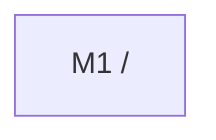

# Implementation Roadmap

> Last Updated: <YYYY-MM-DD>
> Source: `docs/requirements/<path>`, `docs/design/*.md`

## Purpose

This file is the global status index from design to implementation. After reading it, an AI or maintainer knows what is not started, ready, or completed without re-walking every doc and the codebase.

It contains no implementation detail. Each `ready` work item has been draft-reviewed and is queued for implementation.

> This roadmap is optional. See `docs/backlog/00-roadmap-authoring-guide.md` for authoring and update rules. Small projects can delete this file and rely on the backlog table alone.

## Status Values

| Status | Meaning |
| --- | --- |
| `todo` | Not started |
| `ready` | Draft-reviewed, queued for implementation |
| `done` | Completed and passed closure audit |

## Framework / Platform Reuse

Capabilities already provided by the stack, so the project does not rebuild them:

| Capability | Provided by | Notes |
| --- | --- | --- |
| <capability> | <module/package/service> | <already-introduced / not-introduced> |

## Current Baseline

**Already implemented:**

- 

**Main gaps:**

- 

---

## Milestones

### Milestone 1 — <name>

| Work Item | Status | Owner Doc | Dependencies | Reuse |
| --- | --- | --- | --- | --- |
| <work item> | `todo` | `docs/design/<path>` | — | — |

### Milestone 2 — <name>

| Work Item | Status | Owner Doc | Dependencies | Reuse |
| --- | --- | --- | --- | --- |
| <work item> | `todo` | `docs/design/<path>` | — | — |

---

## Work Item Details

### <work item>

> Status: see Milestones table above

**Goal:** <one sentence>

**Delivery scope:**

- <short list>

**Out of scope:** <optional>

**Modules / areas:** <optional>

---

## Dependency Graph

## Cross-Cutting

| Concern | Notes |
| --- | --- |
| Error handling | <convention> |
| Permissions | <convention> |
| Testing | <convention> |
| Owner-doc sync | update design/architecture when a work item closes |
| Dev log | update `docs/logs/` after each implementation |

## Rule

- This file is a status index and coarse-grained split, not an implementation specification.
- Each `ready` work item has been draft-reviewed and is queued for implementation.
- Status lives on work items only; a milestone never carries a status.
- Work-item status changes update the Milestones table only.
- AI takes the first `todo` work item in order, implements it automatically (humans do not review individual implementation), and writes it back to `done` on closure audit. See `docs/backlog/00-roadmap-authoring-guide.md` (Containment, Closed Loop).
